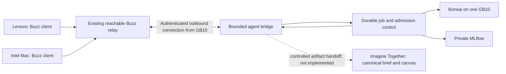

# Could Buzz carry this proof of concept?

Recommendation: use the existing Buzz community as the candidate remote conversation surface for a narrow shared-inference proof of concept. Preserve Imagine Together as the source/canvas/canonical-brief workspace. Do not rebuild either product or claim they are integrated today.

Checked upstream `block/buzz` at `4cd82f513214aad11c2b742ce7cc7c681e8e32a0` on 2026-09-13, plus release `desktop-v0.5.23`. Jai's actual community has not been inspected. [README](https://github.com/block/buzz/blob/4cd82f513214aad11c2b742ce7cc7c681e8e32a0/README.md), [ACP harness](https://github.com/block/buzz/blob/4cd82f513214aad11c2b742ce7cc7c681e8e32a0/crates/buzz-acp/README.md), [release](https://github.com/block/buzz/releases/tag/desktop-v0.5.23).

## The boundary

| Need | Buzz contribution | What remains ours |
|---|---|---|
| Remote people in one place | Desktop clients, relay, channels, threads and agent identities | Verify their actual devices, community access and relay configuration |
| Teammates ask Bonsai | ACP agent harness provides the interaction path | Configure/build a bounded ACP-compatible agent using the local model API; an OpenAI-compatible endpoint alone is not an ACP agent |
| Serve more requests | Agent subprocess concurrency is configurable | Model admission control, GPU capacity, routing, workload budgets and measured tail latency |
| Restart/replay | Harness documents reconnect and subprocess recovery | Persistent idempotency keyed by community/event/task; test duplicate replies, interruption and lost work. Its docs do not guarantee complete delivery |
| Shared canonical grant document | Channel Markdown canvas and conversation | Imagine Together's exact-version review, source-linked visual canvas and explicit publication policy are not automatically reproduced |
| Evidence | Signed event provenance | MLflow trace, actual checkpoint/configuration, usage, latency and explicit human feedback linked to the event |

**Buzz can reduce remote-interface work for testing shared Bonsai access. It does not solve inference performance, and it does not make today's localhost Imagine Together remotely accessible.** A Buzz-only pilot can have teammates discuss source text and receive suggestions in a channel while Jai maintains the canonical brief locally. That proves shared inference and conversation, not the full remote visual/canonical workflow.

## Proposed first path

The clients do not download Bonsai weights. The agent on the GB10 connects to the remote relay; there is no need for teammates to reach port 8001 directly. Hosting the existing relay and data still has costs and operator responsibilities. This topology is a proposal, not a tested deployment.

The release provides Intel macOS x64, Windows x64 and Linux amd64 desktop packages. That is a plausible installation path for the Intel Mac and a typical Intel/AMD Lenovo; verify the Lenovo's actual OS/architecture and supported OS versions. There is no published RAM guarantee establishing success on their laptops. The inspected release has no Linux ARM64 desktop package for Jai's GB10; that is separate from whether headless relay/bridge binaries can be built on ARM64. Do not assume a relay's URL supplies a supported browser client. [Buzz support](https://block.github.io/buzz/support.html).

For the first run, one agent, two explicitly allowed participant identities, one channel and a constrained draft/question operation are enough. The documented default author gate is owner-only; allowlisting both teammates is an explicit setup step. Keep arbitrary shell/file/network tools unavailable to participant requests. Verify channel authorization before retrieving sources; prompts are not permission checks.

A framework configured for a proprietary provider must not silently call that provider when the goal is Bonsai. Verify the effective base URL, model ID and network requests. Test a realistic multi-turn tool flow: our successful one-call suggestion does not establish ACP/tool-use compatibility. Bridge service credentials and tenant mapping do not exist in the current Imagine Together backend; do not give a bot a user's browser cookie as the integration contract.

Treat channel content passed to the bot as disclosed to the bot host and any enabled downstream services. Local inference does not make a hosted relay local-only. [Buzz privacy notice](https://block.github.io/buzz/privacy.html).

## Proof-of-concept acceptance

1. Both actual laptops install/connect and exchange a source and unfinished thought.
2. Each allowlisted person asks the bot the same bounded grant question and receives one complete answer; an unauthorized person/channel is refused.
3. One real job is linked across Buzz event ID, local job ID and MLflow trace; record queue time separately from model time. Log effective checkpoint/configuration and input/output token counts.
4. Restart the bridge and disconnect/reconnect a client. Demonstrate duplicate suppression and readable failed/canceled status. Repeating a model request must not duplicate a document edit.
5. Participants judge whether the suggestion helped and why. Do not claim shared canonical approval until the Imagine Together handoff is separately implemented and tested.

No messages have been sent, no community has been joined, and no integration is active. The actual community URL/invitation and deployed version will be needed for the live step, as Jai previously planned to provide.

## Forecasting eight GB10s

Agent count, machine count and model concurrency are three different numbers. Increasing `--agents` starts more agent processes; it does not create GPU memory, model throughput or eight-node inference. The documented harness serializes prompts within a channel, so a single busy channel can bottleneck even with several agents. Multi-channel/load tests must reflect the intended usage.

Measure one node under the actual prompt lengths, turn counts and simultaneous jobs; add a second independent replica and check routing/failure behavior. Then forecast eight as scenarios with utilization and spare capacity. Report both demand (requests per participant per hour) and supply (successful jobs per replica per hour). The 17-token, 2.03-second app fixture is an integration observation and is too small to predict grant-agent capacity.

An illustrative six-serving-node forecast with 60% utilization would be 864, 432 or 216 jobs/hour if the measured sustained service time were respectively 15, 30 or 60 seconds per job. These are arithmetic scenarios, not forecasts derived from this machine. Multi-turn requests, long context, retries and queue limits change them. Reserve the other two nodes for evaluation/spares only if that allocation fits the measured need and budget.

Decision proposed for human review: use Buzz to qualify remote shared inference before investing in public app deployment or eight machines; retain the working app and its canonical documentation as the foundation. This is not an approval to purchase hardware or a claim that two systems are already integrated.
