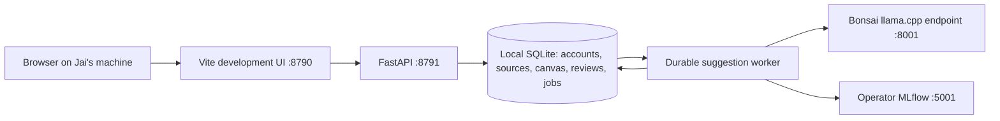
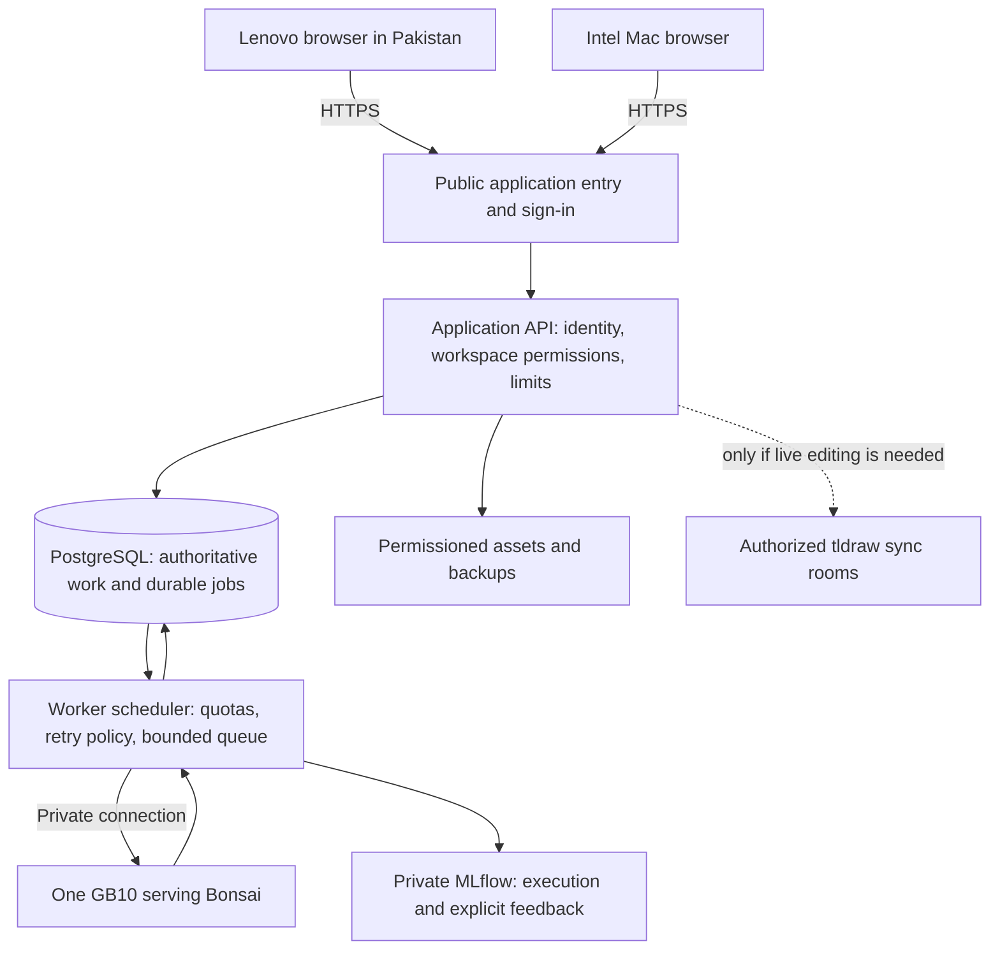

# Imagine Together: shared intelligence on ordinary laptops

Architecture and funding working draft · 13 September 2026 · prepared by Codex at Jai's request. This is a proposal for review, not an approved grant application or a deployed network service.

## The promise

A small community organization should not need an expensive computer to turn unfinished thoughts into a project its people understand and can act on. Imagine Together can put the sources, questions, disagreements and agreed brief in one shared place. Shared inference can make optional writing assistance available through ordinary browsers. The first use case remains grant writers and their collaborators; education and community-health organizations are potential participants, not validated customer segments.

The initiative is a service plus facilitation: a source-grounded collaboration workspace, shared AI capacity, and learning support. Hardware is one input. The grant outcome is people making progress together, not acquiring eight machines.

## Will the two laptops work?

| Situation | Expected result | Why / qualification |
|---|---|---|
| Lenovo with less than 8 GB RAM in Pakistan, accessing a future hosted app | Plausible for modest text-first workspaces; unverified on this device | Browser runs the interface, not the 27B model. OS, actual RAM, supported browser, free memory, large canvases and connection quality matter. A 4 GB test is useful; “less than 8 GB” does not identify the machine. |
| Intel MacBook with 8 GB RAM, accessing a future hosted app | Plausible; unverified on this device | Intel versus ARM does not determine web-app compatibility. An OS that still supports a current browser matters. No CUDA, Python, model download or MLflow install is required on the client. |
| Either laptop opening today's 127.0.0.1:8790 URL | Cannot reach Jai's app | Loopback means the device opening the URL. Today's services bind to Jai's loopback and the API rejects non-local hosts. |
| Either laptop running the entire current Bonsai stack locally | Not a supportable expectation | Model weights, runtime buffers/context and OS must all fit; low-bit storage alone is not total working memory. The current ARM/CUDA serving stack is also different from an Intel Mac or unspecified Lenovo. |
| Offline or unstable network | Current app does not offer reliable offline collaboration | Durable server jobs can survive a client disconnect, but unsaved browser edits and reconnection need explicit testing. Do not promise offline-first or automatic merge. |

No measurement on these two laptops has occurred. Their distance from the server affects round trips and transfers; it does not increase the RAM required to hold model weights because those stay on the server. Text requests are smaller than downloaded model files, but rich media and the initial JavaScript bundle still cost bandwidth.

## Current system — all on Jai's GB10

The canvas is saved as versioned snapshots. Conflicting writers receive a conflict; this is asynchronous handoff, not simultaneous multiplayer. Manual authoring does not require the model. A queued suggestion is a proposal, never an approval. The original personal app on 8780 remains separate.

## Proposed invited service — begin with one GB10

Proposed placement: a small hosted application/database entry point can remain available when the GB10 is down; the GB10 connects privately for inference. This adds hosting and operations cost but avoids making every document dependent on a workstation's uptime. Hosting everything on-site is another option, with internet ingress, power and single-site availability responsibilities. Neither topology has been deployed here.

The browser never receives the model server's credentials or database credentials. Every data/job/evidence request must authorize the workspace. An app workspace tag in MLflow is not an access-control boundary. Keep the operator dashboard private until its independent permissions and artifact isolation are configured and tested. [MLflow network protection](https://mlflow.org/docs/latest/self-hosting/security/network/) and [authentication](https://mlflow.org/docs/latest/self-hosting/security/basic-http-auth/).

A reverse proxy handles HTTPS; production processes require restart, startup and resource policies. Publish built frontend assets, not the Vite development server. Retain server-side membership enforcement behind the proxy. [FastAPI deployment concepts](https://fastapi.tiangolo.com/deployment/concepts/).

The existing tldraw SDK needs the appropriate production license. Live collaboration additionally needs authorized rooms, persistence and assets; its public demo is not a private production backend. [License](https://tldraw.dev/sdk-features/license-key), [sync](https://tldraw.dev/docs/sync).

## What eight machines would mean

Prefer independent inference replicas for this 27B workload: a scheduler routes a job to a healthy GB10 with the right pinned checkpoint. Eight separate memory pools do not automatically become one coherent model memory pool. NVIDIA documents a two-Spark linked configuration; this does not establish eight-node performance for our custom Bonsai fork. Dell's actual configuration and support terms must be verified separately. [NVIDIA hardware](https://docs.nvidia.com/dgx/dgx-spark/hardware.html), [Dell specification](https://www.delltechnologies.com/asset/en-gb/products/workstations/technical-support/dell-pro-max-with-gb10-workstation-brochure-and-spec-sheet.pdf.external).

Specialization can initially mean different instructions, authorized source collections and evaluation sets using the same checkpoint. It does not require eight different fine-tuned models. Separate checkpoint deployments become justified when paired task evidence shows a benefit.

Capacity planning equation, not a forecast:

`jobs/hour ≈ active replicas × measured completed jobs/second/replica × 3600 × planned utilization`

Measure at the concurrency and prompt lengths actually served. Queueing, memory pressure, batching, failures and shared networking prevent linear extrapolation. Illustrative arithmetic only: if a node sustains one job every 30 seconds, six serving nodes at 60% utilization yield 432 jobs/hour. We have NOT measured that service time or capacity. Jobs/hour is not concurrent users: people have different request rates.

Eight nodes could be budgeted as six serving, one evaluation/canary and one spare, but that is an allocation hypothesis. Replicas only provide useful failover if routing, spare capacity, model parity and failure handling are tested. One site's network/power failure can still affect all eight.

Request current quotes for computers, storage, switch/cabling, installation, support, production software licensing, hosted application/database, backup storage, UPS, power/cooling, connectivity and staff. Compute power cost from measured wall power and local tariff: `kW × operating hours × price/kWh`; include cooling and backup overhead. No purchase budget or energy claim is established yet. Compare owned capacity with rented inference for the same workload and privacy requirements.

## Distribution and an evidence-led funding sequence

1. **Two-person remote pilot:** qualify the network release; have these exact teammates capture a source, leave an unfinished thought, exchange revisions, request a change and export the agreed brief. Use one GB10. Observe them, do not replace their feedback with a model judge.
2. **Small cohort:** invite a few community or education project teams through Jai's existing relationships and workshops. Establish ongoing use and service demand. Maven links remain optional, and registrations are measured separately from learning or project outcomes.
3. **Capacity experiment:** replay representative, consented or synthetic requests at increasing concurrency on one node; record latency tails and quality. Validate adding a second independent replica. Test node failure and a queued job recovering without duplicate application.
4. **Conditional eight-node proposal:** demonstrate unmet demand and a capacity/cost model; fund additional nodes against milestones. A proposal can request the full eventual pool while releasing procurement in stages. Do not describe unbought hardware as operational capacity.

## Pilot scorecard — proposed thresholds to agree, not results

| Question | Evidence / initial acceptance proposal |
|---|---|
| Can ordinary laptops participate? | Exact hardware, OS/browser and network recorded; both participants complete source → thought → revision → export without a device-related blocker. Test small text canvases first. |
| Is work preserved? | Zero lost committed edits in conflict/disconnect tests; clearly indicate unsaved work and recover after reconnect. Test offline behavior explicitly. |
| Is it accessible? | Keyboard-only navigation, screen reader and zoom sessions; equivalent text/list route for essential canvas information. WCAG 2.2 AA is a target, not a certification. |
| Do people align? | Each person independently explains the decision, source and remaining disagreement. Both approve the exact revision; count clarification cycles and report usefulness in their own words. |
| Is AI useful? | Human-kept versus rejected suggestions with reasons, unsupported-claim count, correction time and time to a usable brief. Separate model, prompt, retrieval/source selection and interface causes. |
| Can it serve demand? | Report p50/p95 queue wait, inference and end-to-end time, completion/error rate, prompt/output tokens, memory and wall power at each concurrency. Set the latency objective with participants after baseline. |
| Is it economically defensible? | Fully loaded cost per completed and per human-accepted task, support hours, utilization and uptime. Include idle capacity; do not substitute tokens/second for community impact. |

Accessibility reference: [W3C WCAG 2.2](https://www.w3.org/TR/WCAG22/). Browser throttling can simulate network/CPU constraints but cannot certify an 8 GB or smaller physical device.

## Scope and stewardship

Initial community-health use means planning, public resources and grant collaboration. Patient records, clinical recommendations and sensitive student information are outside this pilot. Sector-specific deployment would require its own data agreements, access/retention design, qualified review and evaluation. A grant-writing success does not validate healthcare or educational outcomes.

International collaborators are part of the browser-access design. Decide where data and backups reside, which collaborators can access each workspace, what enters traces, and how deletion/exports work before collecting sensitive material. No eligibility or legal compliance conclusion is inferred from a teammate's location.

## Unfinished questions for Jai and the team

Who is the first organization willing to use this on a real application? Who benefits and who funds ongoing service? Which work must remain available if inference is down? What would make a person choose this over a shared document? What is the smallest outcome worth funding? Which measured bottleneck would eight nodes resolve?

The next step is distribution and observation using this app, with the narrow deployment work needed to let the two teammates participate. It is not another application or an RL commitment.
