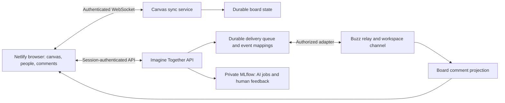

# Live collaborators and conversation where the work happens

Status: proposed implementation contract, 2026-09-13. Requested by Jai. No live presence or Buzz integration deployed by this document.

## Experience

People see named collaborators, their cursors and selections, and whether their app is active, idle or disconnected. A pinned comment such as “@Amina, does this capture our purpose?” opens the same conversation represented in the workspace's Buzz channel. A channel link returns to the relevant board and anchor. Replies from either surface converge on that conversation.

Presence describes application activity, not attention, comprehension, agreement or productivity. Suggested initial semantics: idle after two minutes without input or when the page is hidden; disconnected after the connection heartbeat expires. Show connection uncertainty explicitly. Deduplicate people across tabs, retain separate session IDs, and suppress stale cursors. Offer a keyboard-accessible people list and comment sidebar; never require cursor tracking or color recognition to participate.

## Current evidence

`local-workloads/studio-web/src/Board.tsx` loads a snapshot, debounces whole-document PUTs and stops on revision conflict. This protects against silent overwrites but requires refresh to see collaborators. It is not multiplayer synchronization. Hosted canvas is gated on the production license; the source-and-brief beta remains usable.

The app pins tldraw 5.4.2 and does not install sync or commenting packages. Current upstream documentation must be checked against a mutually compatible pinned package set before implementing it. Buzz's actual community, deployed version, identity mapping and integration credentials are still unverified.

## Responsibilities

Use a persistent JavaScript sync service on GB10 for the first local proof, with one authoritative room per workspace board. Keep Netlify as frontend and HTTP gateway; the existing HTTP function is not the planned WebSocket transport. Qualify an authenticated WSS route separately. A stable connection endpoint is required for the hosted trial; today's temporary tunnel is not an availability commitment. A hosted sync service can be considered later if collaboration must survive GB10 outages.

Replace snapshot PUTs as the live write authority during migration; never run the old writer and sync room concurrently on the same board. Back up the existing document, import once, record migration/schema version, verify shapes and source metadata, and preserve a rollback export. Assets need authorized storage and size limits. Document synchronization does not make the separate grant brief a Google Docs text editor; retain exact-revision approval semantics.

Canvas owns shapes and ephemeral presence. Buzz owns conversation messages and threads. Imagine Together owns canonical source/brief/review records, board anchors and workspace-to-channel authorization mappings. Comments displayed on the board are a projection of Buzz-backed conversations, not a second independently editable message history. Do not enable the stock comment store as an independent authority and then loosely copy messages to Buzz.

If using tldraw's built-in commenting, qualify its extensibility for this projection and obtain a license including commenting. Otherwise build an original accessible pin/sidebar UI over the Buzz-backed adapter. Do not imply the built-in package is already integrated or covered by a basic canvas key.

## Durable events and delivery

Interpret “every event” as every committed work event: source added/updated/deleted, completed board edit batch, comment/reply/edit/deletion, thread resolved/reopened, review submitted, canonical revision published, AI suggestion requested/completed/failed/applied. Aggregate a drag or typing gesture into one meaningful commit; cursor movement, heartbeats and keystrokes are ephemeral and should not flood the channel. Keep a complete authorized durable event ledger, with a readable grouped channel presentation.

Each event carries event ID, workspace/board ID, authenticated actor, type, entity/revision, timestamp and origin. A comment anchor carries page/shape ID or board coordinates plus the Buzz thread/message mapping. Preserve an orphaned anchor when a shape is deleted. Cross-link both surfaces using permission-checked links.

Write app changes and outgoing events in the same local transaction. Retry delivery with stable event IDs; record acknowledgments and deduplicate inbound relay events. Never claim exactly-once remote delivery until Buzz's actual protocol and ambiguous-send recovery are tested. Use origin markers to prevent mirror loops. Buzz outages leave comments visibly pending or failed, never falsely sent. Message edits, deletions and resolution must propagate to the projection. Persist a replay checkpoint and reconcile after restart.

Bind app accounts to verified Buzz identities; do not accept an author ID or mention target supplied by a browser as authority. Both workspace and channel permission must allow a disclosure. A private board must not automatically mirror its contents to a broader community channel. Membership removal must close existing board sessions and stop message/asset access. Specify behavior for mismatched membership before enabling a channel binding. Preview recipients and destination when enabling sharing.

## Observability

Operational metrics: active room/session counts, reconnects, sync lag, persistence failures, undelivered events, oldest pending delivery age, duplicate suppression and authorization denials. Keep these separate from model inference metrics. No permanent cursor trail or time-at-keyboard score.

MLflow records AI suggestion jobs with checkpoint/configuration, latency, token usage, source revision references and explicit usefulness/correction feedback. Add workspace/event/job/trace links with authorization. Preserve the beta's metadata-only trace policy. Human conversation is not automatically model training data, and a comment or presence indicator is not canonical approval.

## Acceptance before release

1. Two independent accounts edit different shapes simultaneously; both converge without losing either edit. Exercise conflicting edits on the same shape and document the result.
2. Cursors follow board coordinates through zoom/pan; names are correct; idle, hidden tab, duplicate tabs and disconnect/reconnect behave as specified.
3. Read-only users cannot mutate shapes by bypassing UI. Unauthorized room/asset access and forged identities fail; removed members lose existing connections.
4. A pinned mention creates one Buzz conversation; reply from Buzz appears at the pin; reply from canvas appears in that thread. Link navigation finds the right anchor. Only allowed recipients are notified.
5. Restart sync and bridge services, interrupt the network around delivery acknowledgment, and replay events. Durable board changes survive; duplicates and mirror loops are detected; pending status remains truthful.
6. Move/delete a commented shape, edit/delete messages, resolve/reopen a thread, and change membership. Both surfaces agree without leaking content.
7. People, comments, mentions and deep links are usable with keyboard and screen reader. Test on the actual low-memory teammate laptops; Bonsai stays on GB10.
8. Run one real grant collaboration and ask whether presence and anchored discussion helped alignment. Record human feedback separately from synthetic integration checks.

Sequence: local two-browser sync proof; authenticated hosted sync after license/endpoint qualification; Buzz adapter after actual server qualification; one grant-room pilot. This document introduces no deployments, invitations or outbound messages.

## Canonical references

- [tldraw sync](https://tldraw.dev/docs/sync): self-hosted sync, WebSocket rooms, persistence and deployment responsibilities.
- [tldraw collaboration](https://tldraw.dev/sdk-features/collaboration): collaboration and presence integration.
- [tldraw commenting](https://tldraw.dev/docs/commenting): anchored threads, identity, server-side permissions and commenting license requirement.
- [Buzz architecture at inspected revision](https://github.com/block/buzz/blob/4cd82f513214aad11c2b742ce7cc7c681e8e32a0/ARCHITECTURE.md): upstream architecture, not proof of this deployment's integration capabilities.
- [Existing Buzz qualification plan](../architecture/BUZZ-POC.md).
