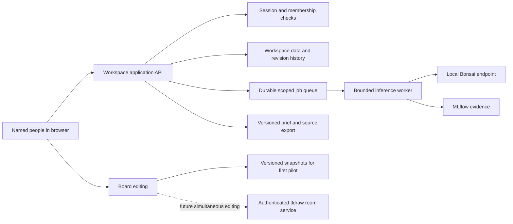

# A shared studio for unfinished thoughts

## What people come here to do

A grant writer and collaborator need somewhere to collect fragments before they know the final argument: an observation, a source, an image, a remembered experience, or a question. They need to arrange those fragments, ask each other what is missing, and gradually write a project brief they both recognize.

The first shared Studio should help two people do that with one real project. Preserve the accepted local app's ability to work manually. Bonsai can ask questions, identify tensions, or suggest wording after a person requests help. It must not invent their experience, turn uncertainty into certainty, or declare that people agree.

The product hypothesis is: **two collaborators can turn scattered material into one versioned project brief with less lost context and clearer agreement about their next action**. This is a proposed test. It is not a demonstrated grant-writing business or a claim that AI produces a more fundable application.

## The first complete shared journey

1. Jai creates a workspace for one project, gives it a plain-language purpose, and invites one named collaborator as an editor.
2. Each person captures material under their own identity. Imported research is visibly marked as research; personal notes remain their own words.
3. They arrange source-card copies on a board. The text/list view remains a complete path for reading, editing, and opening sources.
4. A person asks Bonsai a bounded question using selected material, such as what an intended reader still cannot tell about the project. Suggestions wait for review.
5. An editor creates a canonical project-brief revision from chosen source versions. Open questions, unsupported claims, and disagreements stay visible.
6. Named reviewers approve or request changes on that exact revision. Editing the brief or its governing dependencies makes current approval stale.
7. The owner records the accepted decision and exports the agreed brief with its sources, revision, unresolved issues, and next action.

The first pilot ends with that useful export and the participants' feedback. Automated grant submission, unlimited collaborators, billing, a public grant marketplace, learner tutoring, and model training are outside this stage.

## What belongs in a workspace

| Surface | Purpose | Acceptance signal |
|---|---|---|
| Swipe file | Capture evidence and unfinished human notes without forcing polished prose | Both participants can find and reuse a captured fragment |
| Shared board | Arrange, connect, question, and discuss ideas | Participants can explain the arrangement and recover edits |
| Canonical brief | State the current project intent and supported claims | Named reviewers recognize and approve an exact version |
| Decision ledger | Explain a decision, disagreement, revision, and next action | A returning collaborator understands what changed and why |
| Bonsai suggestions | Offer optional help grounded in selected material | A person explicitly marks what helped or corrects a failure |
| Evidence view | Show execution, sources, model configuration, and feedback | The operator can trace an output to its inputs and diagnose a failure |

Every workspace begins with its own canonical brief. Reusing the application's default product copy as a team's approved position would defeat the purpose of collaboration. A template provides fields, not agreement or facts.

## Canonical project-brief template

Keep the initial document short: working title; intended people and recurring problem; what the team has actually observed; proposed activity; source-supported claims; unknowns and disagreements; resources and constraints; one next test; owner; required reviewers; and what an accepted result would change.

For a grant project, add the applicant's documented status, the specific opportunity/version, eligibility uncertainties, proposed budget, and attachment requirements. Do not prefill aspirations as established outcomes. The brief remains useful before a specific grant is selected.

## Teaching and the Maven relationship

Dharmic Data's canonical messaging starts with a real recurring problem, a small useful test, visible limits, and evidence from use. The collaboration fork should demonstrate that method. The accepted local-app feedback supports preserving the manual experience and human voice; it does not justify inventing a new paid offering.

Use one modest, optional link in the workspace help/about area and at the end of a public explanatory page:

**[Learn with Jai on Maven](https://maven.com/a-plus)**

The canonical Maven profile was opened during this review. The paid workshop booking URL and any future workshop date remain unverified. Do not label this link as a confirmed workshop checkout, add a fabricated date, imply that using Studio requires a course purchase, or interrupt the writing flow with enrollment prompts. A click is interest in learning; it is not enrollment or a sale.

## The proposed architecture

Begin with one API service and durable relational storage. Keep the model worker independently restartable. A real-time canvas room service is a separate, qualified addition because HTTP snapshot replacement cannot safely merge simultaneous edits. The canonical brief and approvals remain application records even when board synchronization is added.

## Stages and boundaries

| Stage | Demonstration | Claim allowed |
|---|---|---|
| Preserved baseline | Accepted single-user release, exact commit, restore instructions | The recorded local paths worked |
| Local collaboration pilot | Separate named accounts in two browser contexts, scoped workspace, conflict handling, canonical review | Tested asynchronous collaboration on this machine |
| Invited network pilot | Protected transport, account lifecycle, recovery, explicit operational limits, qualified license | The exercised invited deployment worked |
| Production proposal | Durable production operations, capacity and tenant tests, real-time qualification if offered | Only the deployed and measured service commitments |

A role switcher on one browser is a demonstration aid, not authentication. Two tabs using one identity do not prove multi-user attribution. Local development mode and a production deployment are different license/operational states.

## What to measure

For the first pair, record the time to a mutually accepted brief, changes requested, unresolved disagreements, source-retrieval effort, whether the agreed next action happened, and whether either participant felt their voice was lost. Keep active human time separate from model wait time. Ask for a concrete correction rather than a generic satisfaction score.

Use two collaboration sessions on the same project to assess whether people can return to the work without re-explaining it. This supplies qualitative product evidence, not a statistical productivity claim. A second independent pair is the next repeatability test after the first pair finds the workflow useful.

Potential buyers include small writing practices, independent grant writers working with clients, and community teams that repeatedly prepare evidence-backed project briefs. Their willingness to pay and the importance of local inference remain hypotheses. The immediate value proposition is keeping the team's sources, unfinished thinking, and exact decisions connected.
