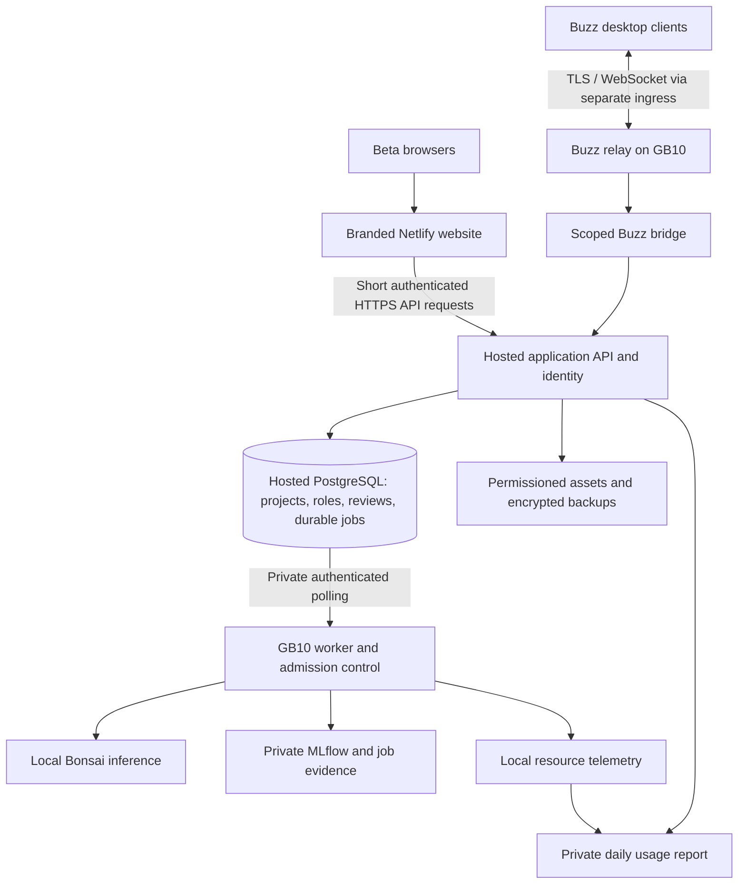

# Product and Netlify deployment decisions

Status: proposed. Defaults below resolve routine design choices so implementation can begin without pretending the user has approved every policy detail.

## Membership and the one-person invitation

A beta learner is an explicitly admitted account, not anyone who finds a URL. Every learner receives one guest slot. A guest can collaborate and participate within granted scopes but receives no automatic onward invitation. Jai can promote a guest to learner explicitly. This bounds a cohort of N learners to at most 2N admitted people through this mechanism, excluding staff; it does not cap each person's number of projects.

One slot means **one active guest relationship**, not one invitation per room. An outstanding invitation reserves that slot. Revocation or expiry releases an unredeemed reservation. A redeemed slot is not automatically reusable by removing the guest; owner review prevents rapid invite cycling. Guest removal does not delete their authored work or silently remove another valid membership. Account suspension overrides all access.

Invitation tokens are random, hash-stored, single-use and expiring. Proposed expiry: seven days. Redemption and slot consumption happen in one database transaction with a uniqueness constraint; simultaneous requests cannot create two guests. Bind acceptance to the intended verified account, prevent self-invitation, and audit issue/redeem/revoke/expire events. Beta admission and project/room membership are separate entitlements. A public signup screen is insufficient.

Proposed tables: beta_memberships(user, role, state), invite_entitlements(learner, slot, state), guest_invites(token_hash, intended_identity, expiry, state), sponsorships(learner, guest), rooms, room_memberships, projects, project_memberships, share_snapshots, review_policies, reviews, audit_events. Use reviewed migrations, not startup create_all, for the release schema.

## Privacy and community sharing

| Surface | Default audience | Sharing behavior |
|---|---|---|
| Personal project / unfinished thought | Creator only | Invite selected collaborators explicitly |
| Shared private project | Named project members | Membership is separate from joining a community room |
| Interest room | Approved room members | Discoverable listing can show title/topic only if owner opts in; private rooms have no listing |
| Community showcase | Admitted beta members | Author explicitly publishes a selected, previewed snapshot; internet-public publishing is out of scope |
| Jai's teaching material | Audience Jai selects | Jai can publish examples without publishing his private projects |
| GPU usage report | Jai / authorized operator only | Members can see their own quota/job status, not another person's usage |

Joining an interest room never shares a person's existing private documents. The Share action shows the exact content, attachments and audience before confirmation. Exclude private source text, collaborator comments, histories and traces unless explicitly selected and authorized. For coauthored work, publication follows the project's approval policy; a room owner cannot override private authorship simply by owning the room.

Publish immutable snapshots with links to explicitly included sources. Later private edits do not silently change the published version. Unpublish removes in-app discovery/access but cannot recall downloads or copies. Search indexes, cached responses, assets, exports and AI retrieval must enforce the same scope as the document. Service operators may technically access storage; say that clearly. This is access-controlled privacy, not a claim of end-to-end encryption.

Room flow: invitation → introduce intention → bring a source → leave an unfinished thought → draft common purpose → preserve disagreement → review exact revision → publish the agreed artifact to the chosen audience. Text/list access must cover essential canvas information. Test with the actual Lenovo and Intel Mac participants, keyboard use, screen readers and zoom.

Maven CTA locations: welcome/orientation, after a useful alignment milestone, optional learning sidebar and export footer. Use “Continue this practice with Jai on Maven” pointing to https://maven.com/a-plus until a specific workshop link is verified. Do not gate export, privacy, invitations or approval on payment. A click is not enrollment or learning success. [WCAG 2.2](https://www.w3.org/TR/WCAG22/).

## Hosting architecture

**Netlify serves the browser application.** It does not host the persistent Buzz relay, Docker database stack or GB10 inference. Start with a separate Netlify site using a `.netlify.app` URL, linked from the branded site when ready. Keep the existing root Netlify build untouched. Later the frontend can use community.dharmicdata.org. The relay will need its own HTTPS/WSS origin or qualified ingress path; do not assign the same hostname to two independent origins without an explicit routing design.

Keep the application API and authoritative project database outside the GB10 so people can save and review when its power or internet fails. Buzz's relay, its own Postgres/Redis/object storage, bridge and inference remain on this machine as requested. This means **Buzz chat and AI stop during a GB10 outage even while the Netlify website and hosted project service remain available**. Netlify's static page alone cannot preserve application availability if its API is also on the powered-off machine.

Proposed ingress: a small authenticated gateway with stable TLS plus a private tunnel to the GB10 relay; support WebSocket upgrade and test reconnect. The agent/worker uses outbound authenticated connections. Do not expose raw model, Postgres, Redis, MinIO or MLflow ports. A tunnel needs monitoring and access policy; it is not authorization by itself. Buzz desktop and website identity linking requires proof of control of a Buzz key, not matching a display name. Revocations must invalidate the link and authorized tools. No turnkey SSO is claimed.

Netlify HTTP proxy requests have a documented 26-second timeout. Use POST /jobs → 202 + job_id, then short authorized status requests; never hold a proxy request open for a whole agent run. API routes must precede SPA fallbacks. Responses containing private data or job evidence require no-store/private behavior and deployed CDN/cache isolation tests. [Netlify rewrites/proxies](https://docs.netlify.com/manage/routing/redirects/rewrites-proxies/).

## Concrete pipeline mapping

| Setting | Beta site proposal |
|---|---|
| Repository/branch | ChaiWithJai/dharmic-data, studio/imagine-together; keep personal branch intact |
| App base/package directory | local-workloads/studio-web; verify Netlify monorepo path resolution in preview |
| Build | npm ci && npm run build; pin compatible Node and lockfile |
| Publish | dist relative to the app base |
| Production hostname initially | Assigned Netlify subdomain; no custom-domain change |
| API | Hosted staging/production endpoints selected per deploy context; same-origin authenticated proxy/BFF preferred |
| Preview identity/data | Separate staging tenant/database and synthetic fixtures; no production guest quota or GB10 secrets |
| Session | Secure HttpOnly cookies; CSRF and exact allowed origins; proxy/header trust validated |
| Secret boundary | Only public config in Vite-built assets; credentials stay in service/runtime secret stores |
| Rollback | Previous Netlify deploy plus compatible API; database migrations need their own forward/rollback strategy |

The repository's current root netlify.toml belongs to the existing branded site and has a CSP whose connect-src does not allow the proposed services. Do not overwrite it. Create a beta-specific config during implementation; qualify CSP against actual fonts/assets/API and any relay use, and test deep links. Merely uploading the existing frontend would leave /api calls broken because its Vite development proxy is not a production backend.

[Netlify deploy contexts](https://docs.netlify.com/deploy/deploy-overview/), [Deploy Previews](https://docs.netlify.com/deploy/deploy-types/deploy-previews/), [environment scopes](https://docs.netlify.com/build/environment-variables/overview/).

## Release tests that matter

Concurrent redemption grants exactly one guest; revoked users lose API/asset/search access; joining a room exposes no personal projects; publishing previews only selected content; unpublish clears authorized discovery/cache; stale approvals cannot publish; Buzz cannot request another room's sources; untrusted previews cannot reach production data; API failure produces a clear unsaved state; GPU outage preserves committed manual work; both actual low-memory laptops complete the flow.

Unselected providers remain explicit implementation choices: hosted API/database, identity/account recovery, private ingress and backup destination. Existing Netlify credentials/pipeline were not inspected or modified; no billing or deployment was initiated.
