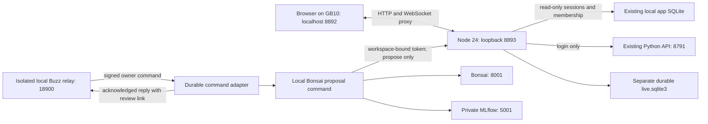

# Imagine Together — local live board

Open **http://127.0.0.1:8892** on Jai's GB10. Sign in using the existing **local** Imagine Together account. Select **Shared Intelligence — Architecture & Funding** to review the first real Bonsai proposal. It remains pending for Jai; no human usefulness rating has been invented.

This is a working local multiplayer proof with an isolated local Buzz relay and a bounded command adapter. It does not replace the existing canvas or connect to Jai’s existing community. Every existing workspace has a **separate, initially empty live board**. Existing sources, snapshots, canonical briefs and approvals remain in the original application. The hosted Netlify grants beta has not changed.

## What runs where



The JavaScript backend manages one `TLSocketRoom` per workspace, `SQLiteSyncStorage` with `NodeSqliteWrapper`, and authenticated WebSockets. It runs on CPU; collaborators do not download model weights. Bonsai inference remains a separate process. This does not establish performance on the teammates' actual laptops or eight-node capacity.

Dependencies pin tldraw/sync/sync-core/assets to **5.4.2**, React 19.2.4 and patched ws/Vite versions in package-lock.json. The implementation follows the [canonical sync guide](https://tldraw.dev/docs/sync) and checks actual installed sources for version-specific behavior. Never run multiple backend instances against the same live database: they would create competing room authorities.

## What is verified

- Two independently authenticated accounts concurrently created shapes and both edits reached all three clients.
- Three-account named presence; hidden-tab idle state; cursor/selection information is carried by tldraw presence. Idle means app inactivity, not lack of attention. People are grouped across sessions, using their most recent activity.
- A collaborator proposed and accepted a synthetic note, which appeared in another browser.
- A viewer who forced the editor into writable mode could not change the server board.
- Outsider access was rejected; removed membership invalidated existing connections. Authorization is checked before every inbound message, plus a two-second background revocation check.
- Disconnect/reconnect and backend restart retained shapes and records.
- Invalid agent credentials, out-of-scope workspace, empty notes, conflicting reuse of an event ID and agent attempts to accept proposals were rejected. Retrying a proposal returned the existing ID.
- A simulated interruption between shape insertion and proposal bookkeeping recovered one accepted shape after restart. Reserved proposal shape IDs cannot be created by clients. Accepted-note edits preserve server-owned provenance.
- Final browser verification reported zero page errors. Production bundle built; dependency audit reported zero known vulnerabilities at verification time.

The browser harness uses Playwright because `agent-browser` is not installed. It uses synthetic accounts in the local pilot; these were removed after verification. It is not a screen-reader audit, a long-duration soak, a power-loss test or a remote-network benchmark.

## AI work and MLflow

`bonsai-propose.py` makes one bounded local model call and submits the returned note to the proposal API. It does not read the board, autonomously plan tool chains, edit existing notes, run shell tools or accept its own work. An instruction file is the deliberately selected context for this first proof. Future board-reading permissions must be explicitly scoped rather than exposing all workspaces to an agent.

The operator configures one workspace and sponsor in protected `.env`; the request cannot pick an actor. Sponsor membership is rechecked on submission. The token grants proposal creation only. A stable event ID prevents duplicate proposals. A protected local response cache supports delivery retries without another model call. This cache contains the note; Git and MLflow do not receive it.

```bash
# Use the existing Python environment with MLflow and requests installed.
../team-studio/.venv/bin/python bonsai-propose.py \
  --instruction-file data/my-instruction.txt \
  --event-id my-stable-work-event-id
```

On this checkout, `../team-studio/.venv` links to the existing collaboration environment. On another machine install the versions recorded in `requirements-agent.txt` in a dedicated environment. Run `mlflow skills list` and consult the installed tracing guidance when changing instrumentation.

The experiment is `my-experiment`, tracking URI defaults to `http://127.0.0.1:5001` and reads `MLFLOW_TRACKING_URI`. Script-level manual spans retain the beta's metadata-only policy: one root, a model span, and a proposal-delivery tool span. They contain actor/workspace/event references, model configuration, token usage, status and proposal ID. Raw instructions, notes and cursor histories are not MLflow artifacts. [MLflow manual tracing](https://mlflow.org/docs/latest/genai/tracing/app-instrumentation/manual-tracing/).

Actual successful model run: [512f044f7e1944d388fd44b6faca0d86](http://127.0.0.1:5001/#/experiments/1/runs/512f044f7e1944d388fd44b6faca0d86), trace `tr-41dae09bb69418e5c48b8b3c38343434`: 127 input tokens, 97 output tokens, completed proposal, human review pending. The earlier generation failed the complete-output check; the successful attempt explicitly uses `reasoning_effort=none`, matching the existing app. This is a configuration observation, not a comparison or capability score. The endpoint is `bonsai-preview-27b-pq2`; its Qwen parent remains unverified.

Acceptance means “put this on the board,” not “this model is useful.” Native MLflow usefulness feedback for this new surface is still to be connected; the original app retains its feedback flow. No training or reinforcement-learning dataset was created.

## Local operations

Prerequisites: Node 24, `npm ci`, the existing local app's SQLite database and Python login API, and a protected `.env` with optional agent credentials. With no agent token, agent access fails closed. Override `LIVE_AUTH_DB`, `LIVE_AUTH_API`, `LIVE_DATA_DIR`, `LIVE_ORIGIN` and `LIVE_PORT` for a separate environment. The Vite proxy currently targets 8893 and the default origin is 8892; update them together.

```bash
python3 deploy/install-local.py
systemctl --user status imagine-live-board-api imagine-live-board-web
systemctl --user restart imagine-live-board-api imagine-live-board-web
journalctl --user -u imagine-live-board-api -n 50
```

The installer starts user services with restrictive file creation permissions and restart-on-failure, including the Buzz adapter when its protected configuration exists. The separately namespaced Docker relay stack must be started as documented in buzz-local/README.md. It **does not enable boot startup, user lingering or network access**. After a reboot, start the existing auth API and both live-board services. A GB10 outage disconnects collaboration; saved documents remain on disk. Unacknowledged client edits are not guaranteed after closing or reloading an offline tab. Read the connection state before leaving; do not advertise offline-first editing.

Live documents, proposals and metadata-only events share `data/live.sqlite3`. SQLite uses WAL and synchronous FULL. Board-record event rows are inserted by SQL triggers within document transactions. They are record-level changes, not a ready-made human-readable channel feed, and do not yet carry authenticated per-edit actor attribution. Proposal events have actor IDs. Presence is ephemeral and has no durable trajectory log.

Back up through SQLite's backup API while running, or stop the backend and copy the database consistently. Do not copy only a live `.sqlite3` file and omit its WAL. A consistent local backup exists under `data/backups`; off-device backup and restore have not been qualified. Preserve the original auth database and `.env` separately; credentials are not source code. Restore with the backend stopped. Never delete real boards to reset a test.

## What Buzz still needs

An isolated local Buzz relay is now running on loopback port 18900, using the pinned upstream ARM64 image. A generated test owner and a separate bot identity belong to a private test channel. Signed commands have triggered real Bonsai proposals and acknowledgments through this relay. No messages or invitations were sent to Jai’s existing community. Its connection details and real participant identities remain unavailable. See [local Buzz operation and verification](buzz-local/README.md).

The implemented adapter verifies event signatures, binds one relay/channel/owner to a sponsor-scoped workspace, deduplicates by event ID, calls the proposal command, and returns a signed acknowledgment and permission-checked workspace link. Real-relay authentication, command flow and restart/replay were tested. Multiple participant mappings and relaying review decisions remain future work. A dedicated scoped bot principal is preferable to the local operator sponsor used for this proof.

Comments, mentions, replies, edit/delete semantics and message delivery state belong to Buzz. We disabled tldraw cursor chat and strip its message field server-side so it cannot silently create a second messaging system. The command adapter has a separate durable inbox and signed-reply outbox with acknowledgment and retry state. The general board-event ledger is not mirrored into Buzz yet: readable change batching, authenticated per-edit attribution, comments, and two-way review status remain future work. [Inspected Buzz architecture](https://github.com/block/buzz/blob/4cd82f513214aad11c2b742ce7cc7c681e8e32a0/ARCHITECTURE.md).

## Before remote use

Keep the services on loopback. The current frontend is a local Vite development server, not a public web deployment. The next hosted stage needs:

1. Valid production tldraw license; include commenting if choosing the built-in commenting package. [License-specific commenting guidance](https://tldraw.dev/docs/commenting).
2. A stable TLS/WebSocket endpoint to the local backend. The existing Netlify HTTP function is not this transport.
3. A same-origin authenticated ticket endpoint in the hosted API. Issue a short-lived, room-bound connection ticket and recheck membership server-side. The Netlify `__Host-` cookie will not automatically authenticate a socket on a different hostname; never put the gateway/agent token into browser assets.
4. Hosted account identity integration; today's live-board service reads the **local pilot** identity database, not the separate beta account database.
5. Bounded authenticated asset storage before enabling images, permission-checked board deep links, backup/restore and real low-memory-client tests.

Do not enable two writers on the old snapshot board. Any future migration must freeze that writer, export/import once, preserve source metadata and verify rollback before making sync authoritative.

## Reproduce the verification

With the local auth API and both live-board services running:

```bash
node test/verify.mjs
npm test
python3 test/cleanup-fixtures.py
systemctl --user restart imagine-live-board-api
```

The browser harness creates explicitly named synthetic accounts and one fixture workspace in the local pilot. The contract tests spawn a separate temporary agent backend on 18893, bound only to that fixture, so they never use the real sponsor token. `test/cleanup-fixtures.py` removes only the harness's `livefixture_*_<timestamp>` accounts and their specially named fixture workspaces. Screenshots and sanitized results remain under ignored `data/`. The example browser executable path is specific to this machine; adjust it for another installation. A backend restart was additionally exercised between document creation and the snapshot assertion; the test name alone is not a restart test.

The loaded server's model-file argument was inspected after the successful run and the referenced artifact hashed: `latest-27B-PQ2_0.gguf`, SHA-256 `693230b006b54da569ff9f1a81d0cfb80a2c85216f62628217fcc587d2e28ab4`, 7,253,354,784 bytes. This pins the observed local artifact, not its unverified upstream training lineage.
